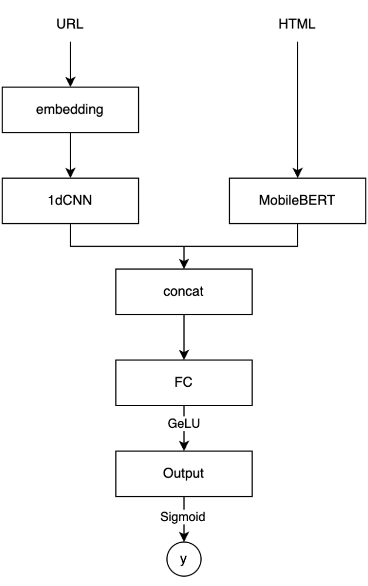

<div align="center">

# Wegis Server

**CNN + BERT multimodal Phishing Detection Server**

[](https://www.python.org/)
[](https://fastapi.tiangolo.com/)
[](https://www.postgresql.org/)
[](https://redis.io/)
[](https://www.mongodb.com/)

</div>

_[Wegis](https://github.com/bnbong/Wegis) - A Chrome browser extension's server that provides real-time protection against phishing sites by analyzing all links on web pages users visit._

---

## Features

- **Real-time phishing site detection**: High-precision analysis through CNN + BERT-based AI model
- **Multi-layer caching system**: Fast response times through Redis-based result caching
- **RESTful API**: Extensible web API based on FastAPI

## API Endpoints

### Analyze API

- `POST /analyze/check` - Single URL phishing analysis
- `POST /analyze/batch` - Multiple URL batch analysis (for browser extensions)
- `GET /analyze/recent` - Recent analysis results

### Other API

- `GET /health` - Server status check
- `POST /feedback/*` - User feedback management

more details in live server's [API documentation](http://localhost:8000/docs)

## AI Model structure



## Quick Start

### Development environment setup

```bash
# 1. Development environment setup
make dev-setup

# 2. Environment variable setup (.env file editing)
cp env.example .env
# Edit the .env file to set the necessary settings

# 3. Start the service
make up

# 4. Server access
# API: http://localhost:8000
# Docs: http://localhost:8000/docs
```

### Local Development Commands

```bash
# Manage all services
make up          # Start all services
make down        # Stop all services
make logs        # Check logs
make health      # Check service status

# Development only
make db-only     # Start only database services
make shell       # Server container access
make logs-server # Server log only

# Test environment
make test-up     # Start test database
make test        # Run all tests
make test-down   # Stop test database

# Database management
make migrate     # Run migrations
make reset       # Delete all data (WARNING: This will delete all data!)

# Testing
make test        # Run all tests
make test-up     # Start test database
make test-down   # Stop test database
make test-logs   # Show test environment logs
```
