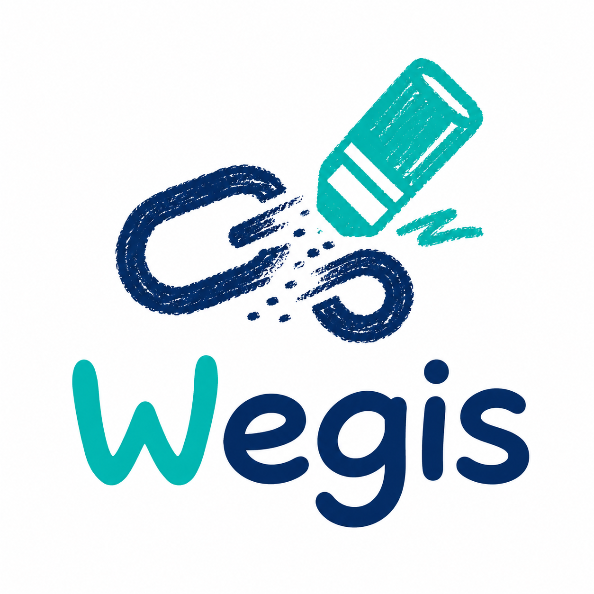
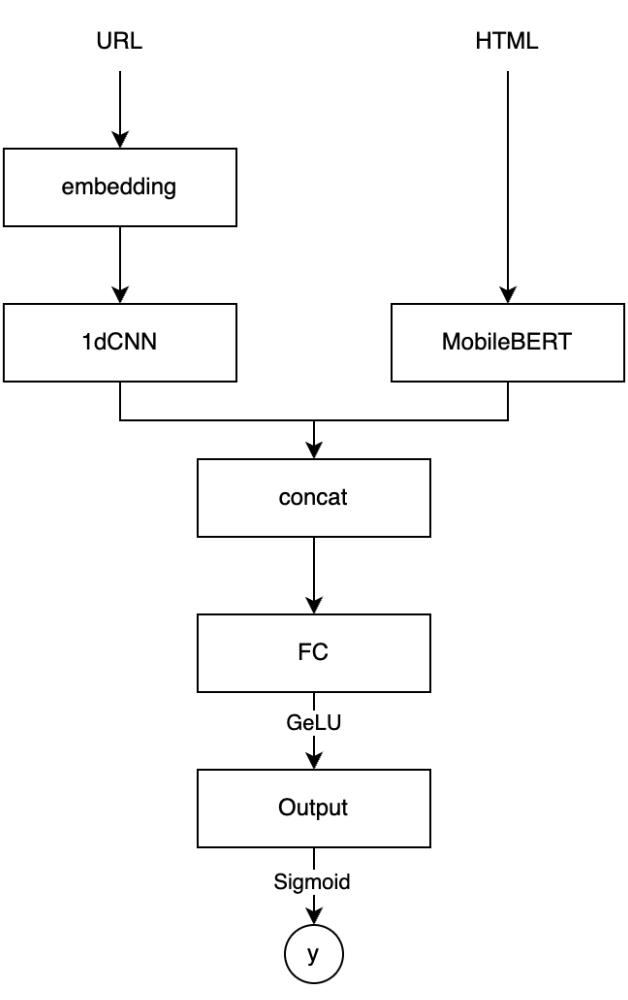

<p align="center">
    
</p>
<p align="center">
<em><b>Wegis Server:</b> CNN + BERT multimodal Phishing Detection Server</em>
</p>
<div align="center">

[](https://www.python.org/)
[](https://fastapi.tiangolo.com/)
[](https://www.postgresql.org/)
[](https://redis.io/)

</div>

_[Wegis](https://github.com/bnbong/Wegis) - A Chrome browser extension's server that provides real-time protection against phishing sites by analyzing all links on web pages users visit._

---

## Features

- **Real-time phishing site detection**: High-precision analysis through CNN + BERT-based AI model
- **Multi-layer caching system**: Fast response times through Redis-based result caching
- **RESTful API**: Extensible web API based on FastAPI

## API Endpoints

### Analyze API

- `POST /analyze/check` - Single URL phishing analysis
- `POST /analyze/batch` - Multiple URL batch analysis (for browser extensions)
- `GET /analyze/recent` - Recent analysis results

### Other API

- `GET /health` - Server status check

## AI Model structure



## Quick Start

### Development environment setup

```bash
# 1. Development environment setup
make dev-setup

# 2. Environment variable setup (.env file editing)
cp env.example .env
# Edit the .env file to set the necessary settings

# 3. Start the service
make up

# 4. Server access
# API: http://localhost:8000
# Docs: http://localhost:8000/docs
```

### Local Development Commands

| Command | Description |
| --- | --- |
| `make up` | Start all services |
| `make down` | Stop all services |
| `make logs` | Tail all service logs |
| `make health` | Check service status |
| `make db-only` | Start only database services (PostgreSQL, Redis) |
| `make shell` | Open a shell in the server container |
| `make logs-server` | Tail server logs only |
| `make migrate` | Run database migrations |
| `make reset` | Delete all data (WARNING: destroys all data) |
| `make test-up` | Start the test database |
| `make test` | Run all tests |
| `make test-down` | Stop the test database |
| `make test-logs` | Show test environment logs |

## Operations

### Analysis pipeline

- Order: `whitelist → blacklist → URL reputation → analysis cache → HTML model`.
- Non-HTML resources are not sent to the HTML model. They return `result=false`, `source="non_html"`, and are not cached.
- Reputation hits return `result=true`, `source="reputation:<provider>"`.

### Request policy

- `check` uses `context=navigation` and runs the full pipeline.
- `batch` uses `context=link`: reputation/cache only; cache misses return `status="pending"` unless `LINK_BACKGROUND_MODEL=true`.
- Responses include `severity: block | warn | allow`; `result` is true only for `block`.
- Blacklist and reputation can block. Model/cache signals are thresholded and never hard-block links.

### Operational safety

- Batch size/concurrency/timeout are bounded (`MAX_BATCH_URLS`, `BATCH_CONCURRENCY`, `BATCH_PER_URL_TIMEOUT`); global overload returns 429.
- SSRF guard allows only public http(s) targets on ports 80/443 and re-validates redirects.
- `/analyze/*` supports Redis rate limits and optional `X-Wegis-Token` auth via `WEGIS_API_TOKENS`.

### Caching

- Analysis results: `wegis:analysis:*`.
- Reputation verdicts: `wegis:reputation:*`; unknown results are not cached.
- Legacy `wegis:phishing:*` keys expire naturally. Signed URLs are canonicalized with recognized signing params removed.

### Reputation providers

- Providers are server-side only and disabled unless their API key is set.
- Supported keys: `GOOGLE_SAFE_BROWSING_API_KEY`, `URLHAUS_AUTH_KEY`, and optional `VIRUSTOTAL_API_KEY`.
- Provider errors/timeouts fail open, and concurrent lookups are bounded/coalesced to protect quota.
- VirusTotal only checks high-risk download URLs and delegates scanning by URL; the server does not download files.
